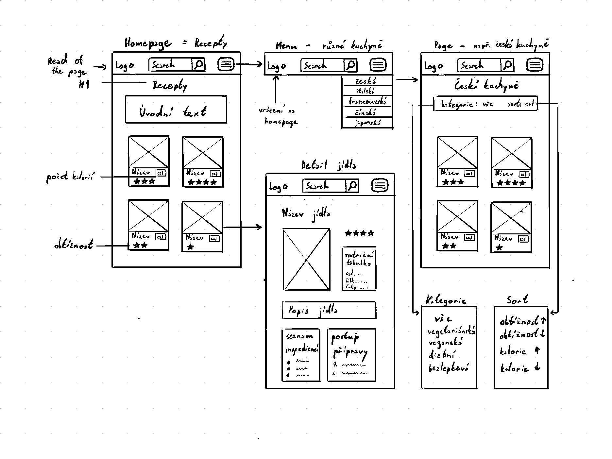
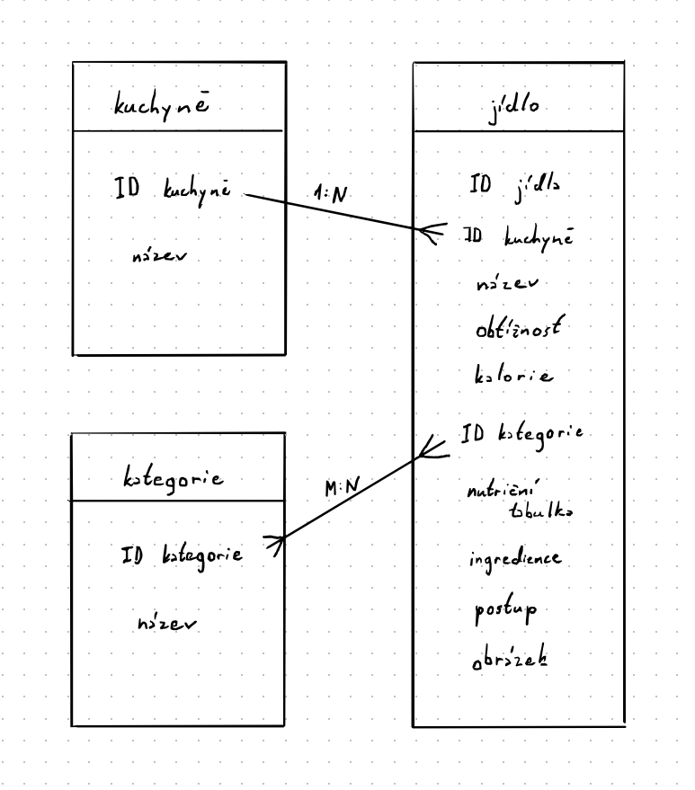

# Databáze receptů jídel

*Autor: Kira stěpanova*

Ročníkový projekt z předmětu webové technologie ve šk. roce 2024/2025

## Odborný článek
Databáze receptú jídel je webová aplikace přístupná na *odkaz*.

V administraci se spravuje databáze receptů různých jídel. Každé jídlo má v databázi název, obtížnost přípravy, nutriční tabulku, popis, seznam ingridiencí, postup přípravy a obrázek. 

Na homepage je úvodní text popisující záměr webu a seznam nejpopulárnějších jídel. Seznam jídel tvoří kartičky, na kterých se zobrazuje obrázek jídla, název, počet kaloríí a obtížnost přípravy. Kliknutím na kartičku se zobrazí stránka detailu jídla, kde se zobrazují všechny jeho atributy. 

Každá stránka obsahuje head, kde je logo, search bar a tlačítko menu. Kliknutím na logo se vždy otevře homepage. V search baru se může vyhledat konkrétní jídlo. Kliknutím na tlačítko menu se otevře nabídka různých kuchyň.

Po vybrání kuchyně se otevře stránka se seznamem odpovídajících jídel dané kuchyně, který je možné filtrovat dle kategorie jídla a řadit dle počtu kalorií a obtížnosti přípravy. Seznam jídel se tvoří stejným způsobem jako na homepage a po rozkliknutí se zobrazí stránka detailu jídla.

## Wireframe

## DB schéma

